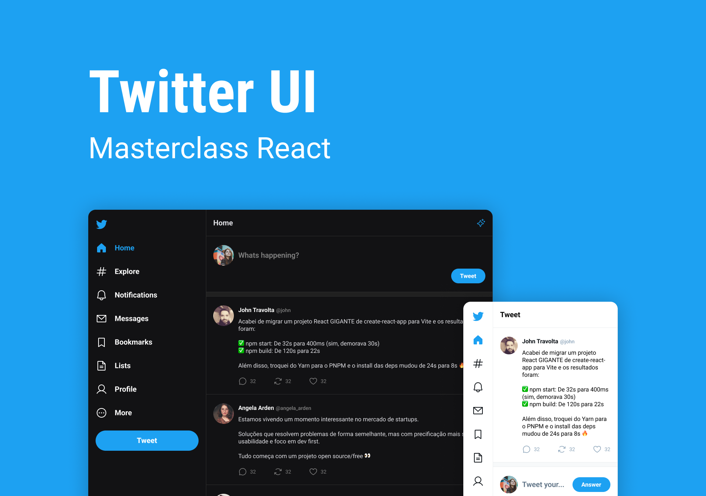

#  UI Twitter

> Clone da interface de usuário (UI) do Twitter.

Projeto desenvolvido na [Masterclass React](https://quiz.rocketseat.com.br/masterclass/react) da [Rocketseat](https://www.rocketseat.com.br/).

## 💻 Projeto

[🔗 Figma](https://www.figma.com/community/file/1202694130789327431)

## ✔️ Resultado

[🔗 Acesse aqui](https://ui-twitter-omega.vercel.app/)

## 🛠️ Tecnologias

- ViteJS
- JavaScript;
- Typescript;
- ReactJS;

## 💙 Contato

  
  
  

